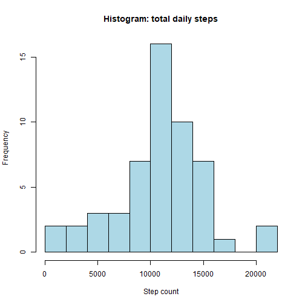
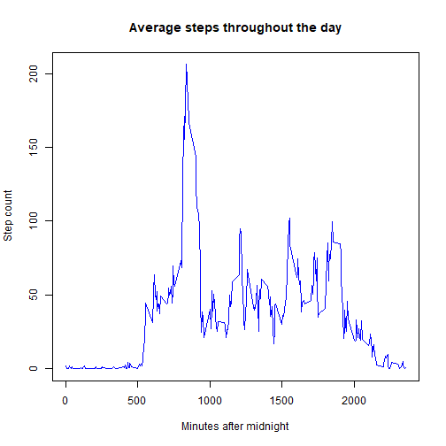
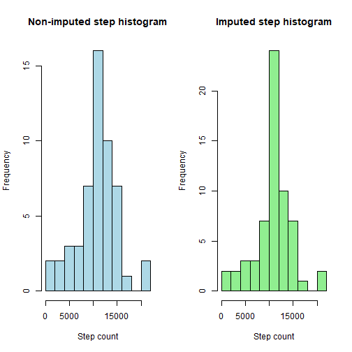
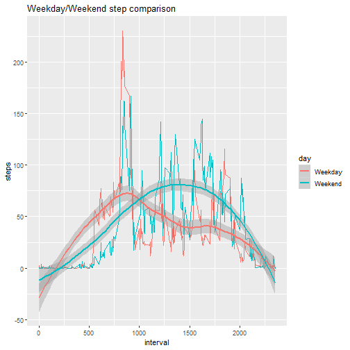

Reproducible Research: Week 2 Project
==========================================

### Loading and preprocessing the data

Show any code that is needed to

1. Load the data (i.e. \color{red}{\verb|read.csv()|}read.csv())
2. Process/transform the data (if necessary) into a format suitable for your analysis


```r
#Data is read with read.csv, and necessary libraries are loaded:
library(dplyr)
library(ggplot2)
library(reshape2)

activity = read.csv("activity.csv")
```

### What is mean total number of steps taken per day?

For this part of the assignment, you can ignore the missing values in the dataset.

1. Calculate the total number of steps taken per day
2. If you do not understand the difference between a histogram and a barplot, research the difference between them. Make a histogram of the total number of steps taken each day


```r
# Sum daily steps and plot histogram
actsum = summarise(group_by(activity,date),steps = sum(steps))
with(actsum,hist(steps,breaks = 10,
                 main = "Histogram: total daily steps",
                 xlab = "Step count", 
                 col = "lightblue"))
```



3. Calculate and report the mean and median of the total number of steps taken per day

```r
#Mean and median of steps taken per day
mean(actsum$steps,na.rm = TRUE)
```

```
## [1] 10766.19
```

```r
median(actsum$steps,na.rm = TRUE)
```

```
## [1] 10765
```

### What is the average daily activity pattern?

1. Make a time series plot (i.e. \color{red}{\verb|type = "l"|}type="l") of the 5-minute interval (x-axis) and the average number of steps taken, averaged across all days (y-axis)


```r
#Time series of steps
complete = activity[complete.cases(activity),]
timemean = summarise(group_by(complete,interval),steps = mean(steps))
with(timemean,plot(interval,steps,type = "l",col = "blue",xlab = "",ylab = ""))
title(main = "Average steps throughout the day",
      xlab = "Minutes after midnight",ylab = "Step count")
```




2. Which 5-minute interval, on average across all the days in the dataset, contains the maximum number of steps?

```r
#Timing of maximimum average steps
maxsteps = timemean[which.max(timemean$steps),]
maxsteps$interval
```

```
## [1] 835
```

### Imputing missing values

Note that there are a number of days/intervals where there are missing values (coded as \color{red}{\verb|NA|}NA). The presence of missing days may introduce bias into some calculations or summaries of the data.

1. Calculate and report the total number of missing values in the dataset (i.e. the total number of rows with \color{red}{\verb|NA|}NAs)

```r
# total missing values
natot = sum(is.na(activity$steps))
```

2. Devise a strategy for filling in all of the missing values in the dataset. The strategy does not need to be sophisticated. For example, you could use the mean/median for that day, or the mean for that 5-minute interval, etc.
    Strategy: replace NA's with mean step count from that time interval.
3. Create a new dataset that is equal to the original dataset but with the missing data filled in.

```r
impute = timemean$steps[match(activity$interval,timemean$interval)]
actimp = transform(activity, steps = ifelse(is.na(activity$steps), 
                                  yes = impute, no = activity$steps))
```


4. Make a histogram of the total number of steps taken each day and Calculate and report the mean and median total number of steps taken per day. Do these values differ from the estimates from the first part of the assignment? What is the impact of imputing missing data on the estimates of the total daily number of steps?

```r
impsum = summarise(group_by(actimp,date),steps = sum(steps))
par(mfrow = c(1,2))
with(actsum,hist(steps,breaks = 10,
                 main = "Non-imputed step histogram",
                 xlab = "Step count", 
                 col = "lightblue"))

with(impsum,hist(steps,breaks = 10,
                 main = "Imputed step histogram",
                 xlab = "Step count", 
                 col = "lightgreen"))
```



```r
median(impsum$steps)
```

```
## [1] 10766.19
```

```r
mean(impsum$steps)
```

```
## [1] 10766.19
```

The differences are negligible, but overall the values shift slightly toward the median and away from extremes.

### Are there differences in activity patterns between weekdays and weekends?

For this part the \color{red}{\verb|weekdays()|}weekdays() function may be of some help here. Use the dataset with the filled-in missing values for this part.

1. Create a new factor variable in the dataset with two levels - "weekday" and "weekend" indicating whether a given date is a weekday or weekend day.

```r
#Comparing weekdays and weekends
actimp$date = as.Date(actimp$date)

    #First we create a "weekday" or "weekend" tag.
actweek = transform(actimp, 
                    day = ifelse(weekdays(actimp$date) %in% c("Monday", "Tuesday", "Wednesday","Thursday","Friday"),
                    yes = "Weekday",no = "Weekend"))

    #Then we melt and re-cast the data, grouped by interval and type of day.
actweeks = subset(actweek, select = -date)
mlt = melt(actweeks, id = c("interval","day"))
comb = dcast(mlt,interval + day ~ variable, mean)
```

2. Make a panel plot containing a time series plot (i.e. \color{red}{\verb|type = "l"|}type="l") of the 5-minute interval (x-axis) and the average number of steps taken, averaged across all weekday days or weekend days (y-axis). See the README file in the GitHub repository to see an example of what this plot should look like using simulated data.

```r
qplot(interval,steps,data = comb,color = day,geom = c("line","smooth"), 
      main = "Weekday/Weekend step comparison")
```

```
## `geom_smooth()` using method = 'loess' and formula 'y ~ x'
```


